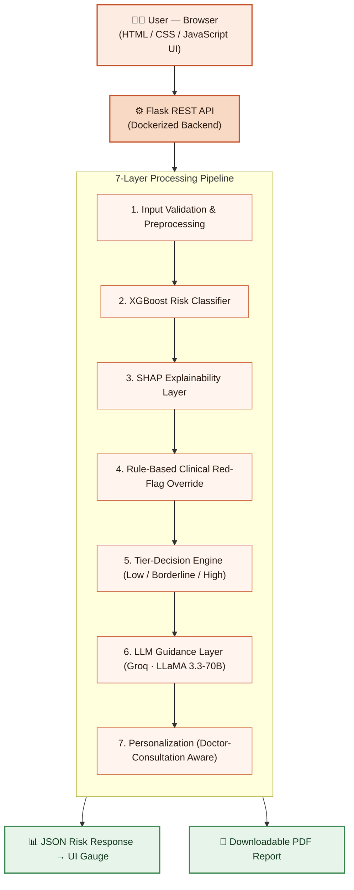
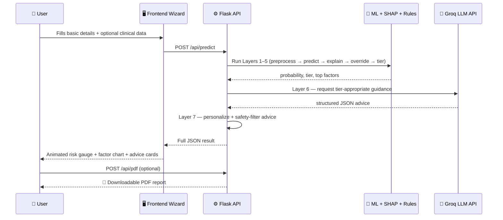

<div align="center">

# 🩺 AI-Based PCOS Screening

### An AI-Assisted Early Screening & Lifestyle Guidance System

*A full-stack, explainable AI web app that estimates PCOS risk from self-reported symptoms — and tells you **why**.*

[](https://ai-based-pcos-screening.onrender.com/)
[](https://python.org)
[](https://flask.palletsprojects.com/)
[](https://xgboost.readthedocs.io/)
[](https://www.docker.com/)
[](#-license)

**⚠️ This is a screening tool, not a medical diagnosis. It does not replace a licensed clinician.**

[Try it live →](https://ai-based-pcos-screening.onrender.com/) &nbsp;•&nbsp; [How it works](#-how-it-works-in-plain-english) &nbsp;•&nbsp; [Run it yourself](#-run-it-locally-2-commands) &nbsp;•&nbsp; [Architecture](#-system-architecture)

</div>

---

<div align="center">
<table width="100%">
<tr>
<td width="33%" valign="top">

### 🌸 Overview
- [💡 What is this project?](#-what-is-this-project)
- [🎯 Why it matters](#-why-it-matters)
- [🧭 How it works, in plain English](#-how-it-works-in-plain-english)
- [🧩 The 7-Layer Pipeline](#-the-7-layer-pipeline)

</td>
<td width="33%" valign="top">

### 🏗️ Under the Hood
- [🏗 System Architecture](#-system-architecture)
- [🔄 Data Flow](#-data-flow)
- [🖥️ App Walkthrough (Screens)](#-app-walkthrough-screens)
- [🛠️ Tech Stack](#-tech-stack)
- [📁 Project Structure](#-project-structure)

</td>
<td width="33%" valign="top">

### 🚀 Get Started
- [⚡ Run it locally (2 commands)](#-run-it-locally-2-commands)
- [☁️ Deploy it yourself](#-deploy-it-yourself)
- [🔌 API Reference](#-api-reference)

</td>
</tr>
<tr>
<td width="33%" valign="top">

### 📊 Results
- [📈 Model Performance](#-model-performance)
- [🛡️ Safety Guardrails](#-safety-guardrails)

</td>
<td width="33%" valign="top">

### 🔭 Beyond
- [🚧 Limitations & Roadmap](#-limitations--roadmap)
- [🎓 Academic Context](#-academic-context)

</td>
<td width="33%" valign="top">

### 📄 Legal
- [⚖️ License](#-license)

</td>
</tr>
</table>
</div>

---

## 🌸 What is this project?

**PCOS (Polycystic Ovary Syndrome)** affects roughly **1 in 10 women** of reproductive age — and a large share of them don't know they have it.

This project is a **web app** where anyone can answer a few simple questions about their health and lifestyle, and instantly get:

| You get... | What that means |
|---|---|
| 🎯 **A risk score** | A percentage, not a scary yes/no verdict |
| 🪧 **A risk tier** | Low / Borderline / High — color coded, easy to read |
| 🔍 **An explanation** | The top 3 factors that pushed your score up or down |
| 💡 **Personalized guidance** | Lifestyle, mental wellbeing & Ayurvedic-support tips (AI-written, safety-checked) |
| 📄 **A downloadable report** | A clean PDF you can bring to your doctor |

It is **not** a diagnostic device. Think of it like a smart, friendly questionnaire that helps you decide *"should I go see a doctor about this?"*

---

## 💡 Why it matters

Most PCOS tools online fall into two extremes:

- 📄 **Static blog-style pages** — generic advice, no personalization
- ❓ **Simple quizzes** — a single yes/no verdict with zero explanation

Neither approach builds trust or gives a clear next step. This project instead:

✅ Gives a **calibrated probability**, not a binary verdict
✅ **Explains** exactly which factors mattered for *your* result
✅ Applies **clinical safety rules** so an obviously high-risk case is never missed just because a model was uncertain
✅ Produces **safety-filtered**, doctor-aware AI guidance — never a diagnosis, never medication dosages

---

## 🧭 How It Works, In Plain English

Imagine an assembly line with 7 stations. Your answers walk through each one, and by the end you get a clear, explained result.

```mermaid
flowchart LR
    A["📝 You fill a<br/>simple form"] --> B["🧮 AI model<br/>estimates risk %"]
    B --> C["🔍 Explains which<br/>answers mattered most"]
    C --> D["🚩 Safety check:<br/>any red flags?"]
    D --> E["🎯 Final Tier:<br/>Low / Borderline / High"]
    E --> F["🤖 AI writes<br/>lifestyle advice"]
    F --> G["👩‍⚕️ Advice tailored to<br/>your medical history"]
    G --> H["📄 View result +<br/>download PDF"]

    classDef nodeStyle fill:#fdece2,stroke:#c8532a,stroke-width:2px,color:#2b1a12
    class A,B,C,D,E,F,G,H nodeStyle
```



> ⚠️ **No matter how the AI reasoning layer performs, a set of deterministic clinical rules (Layer 4) can never be overridden** — this is what keeps the tool safe even when the machine-learning model is uncertain.

## 🧱 The 7-Layer Pipeline

Every screening request passes through **seven independent, testable layers**:

| # | Layer | File | Plain-English Job |
|---|---|---|---|
| 1️⃣ | **Preprocessing** | `preprocessing.py` | Cleans & encodes your answers into numbers the model understands |
| 2️⃣ | **ML Classification** | `train.py` → `pcos_model.pkl` | XGBoost (or RandomForest fallback) predicts a 0–1 risk probability |
| 3️⃣ | **Explainability** | `explainability.py` | SHAP identifies the **top 3 reasons** behind *your specific* result |
| 4️⃣ | **Clinical Override** | `tier_logic.py` | Hard safety rules force a "High Risk" flag when clinically obvious — no matter what the model says |
| 5️⃣ | **Tier Decision** | `tier_logic.py` | Combines probability + red flags into the final Low / Borderline / High tier |
| 6️⃣ | **LLM Reasoning** | `llm_service.py` | Groq's LLaMA 3.3-70B turns the tier + factors into structured, human-readable advice |
| 7️⃣ | **Personalization** | `llm_service.py` | Adjusts advice so it never contradicts a doctor consultation or medication already in place |

> 🛟 **No AI key? No problem.** If `GROQ_API_KEY` isn't set, Layers 6–7 fall back to safe, pre-written template advice. The app still works fully — just without AI-generated phrasing.

---
## 🏗 System Architecture



**Three simple tiers:**
1. **Presentation layer** — a single-page wizard (HTML/CSS/JS) in your browser
2. **Application layer** — a Flask API that runs the 7-layer pipeline
3. **Data/model layer** — the trained ML model file (`.pkl`) + the external Groq LLM API

---

## 🔄 Data Flow



---

## 📱 App Walkthrough (Screens)

<table>
<tr>
<td width="50%" valign="top">

**1️⃣ Landing & Education**
Explains PCOS in plain language before you start — no jargon, sets expectations for a ~3 minute screening.

**2️⃣ Basic Details Form**
Age, height/weight (auto-BMI), cycle regularity, hair/skin symptoms, stress & exercise habits.

**3️⃣ Doctor-Consultation Branch**
One simple question: *"Have you consulted a doctor about this before?"* — this personalizes everything that follows.

</td>
<td width="50%" valign="top">

**4️⃣ Optional Clinical Details**
Hormonal panel (FSH, LH, AMH, TSH, etc.) and ultrasound data — **all optional**, blank fields are safely auto-filled.

**5️⃣ Result Dashboard**
Animated risk gauge, color-coded tier, and a "What influenced this result most" chart.

**6️⃣ Guidance Cards + PDF**
Lifestyle, mental wellbeing, and Ayurvedic-support tips, plus a downloadable, doctor-shareable PDF report.

</td>
</tr>
</table>

> 🔗 **See it live:** [ai-based-pcos-screening.onrender.com](https://ai-based-pcos-screening.onrender.com/)

---

## 🛠 Tech Stack

| Layer | Technology | Why |
|---|---|---|
| 🎨 **Frontend** | HTML5, CSS3, JavaScript | Single-page guided wizard, no heavy framework needed |
| ⚙️ **Backend** | Python + Flask | Lightweight REST API, no unnecessary overhead |
| 🧠 **ML Model** | XGBoost (+ RandomForest fallback) | Best-in-class for mixed tabular health data |
| 🔍 **Explainability** | SHAP | Explains *individual* predictions, not just overall trends |
| 🤖 **LLM** | Groq API — LLaMA 3.3 70B | Fast, free-tier friendly, strong instruction-following |
| 📄 **Reporting** | ReportLab | Generates the polished, printable PDF report |
| 🐳 **Deployment** | Docker + Render.com | One image, deployable anywhere Docker runs |

---

## 📁 Project Structure

```
pcos-predictor/
├── Dockerfile
├── requirements.txt
├── run_local.sh
├── .env.example
├── app/
│   ├── main.py              # Flask entrypoint — /api/predict, /api/pdf
│   ├── preprocessing.py     # Layer 1 — cleaning & encoding
│   ├── explainability.py    # Layer 3 — SHAP explanations
│   ├── tier_logic.py        # Layers 4 & 5 — safety rules + tier decision
│   ├── llm_service.py       # Layers 6 & 7 — Groq-powered guidance
│   ├── pdf_report.py        # PDF report builder
│   └── model/
│       ├── train.py         # Layer 2 — model training script
│       └── pcos_model.pkl   # trained model (generated on first run)
├── templates/index.html     # single-page wizard UI
├── static/style.css
├── static/app.js
└── data/
    ├── generate_synthetic_data.py
    └── pcos_dataset.csv     # generated on first run (or swap for real Kaggle data)
```

---

## 🚀 Run it locally (2 commands)

```bash
git clone <this-repo> && cd pcos-predictor
./run_local.sh
```

That's it. The script creates a virtual environment, installs dependencies, trains the model on first run, and starts the app at:

👉 **http://localhost:7860**

### 🔑 Want AI-generated advice instead of templates?

Grab a free key from [console.groq.com/keys](https://console.groq.com/keys) and add it to `.env` (auto-created from `.env.example` on first run):

```env
GROQ_API_KEY=gsk_xxxxxxxxxxxx
```

<details>
<summary><b>Prefer manual setup?</b> (click to expand)</summary>

```bash
python3 -m venv .venv && source .venv/bin/activate
pip install -r requirements.txt
python app/model/train.py
python -m app.main
```

</details>

---

## ☁️ Deploy it yourself

### Option A — Hugging Face Spaces (Docker SDK)

1. Create a new Space → SDK: **Docker** → hardware: CPU basic is enough
2. Push this repo (or connect your GitHub repo) to the Space
3. In **Settings → Repository secrets**, add `GROQ_API_KEY` (optional but recommended)
4. Done — the Dockerfile trains the model at build time and serves the app on port `7860`

### Option B — Any Docker host (Render, Railway, etc.)

The app is a single self-contained `Dockerfile` with no host-specific assumptions — build it and deploy it anywhere Docker runs.

### 📊 Using the real Kaggle dataset instead of synthetic data

1. Download `PCOS_data_without_infertility.csv` from Kaggle ("PCOS Dataset" by Prasoon Kottarathil)
2. Save it as `data/pcos_dataset.csv` (matching column names in `preprocessing.py`)
3. Re-run `python app/model/train.py`
4. Re-build / redeploy

---

## 🔌 API Reference

| Method | Endpoint | Description |
|---|---|---|
| `GET` | `/api/health` | Liveness check + model metrics |
| `POST` | `/api/predict` | Runs all 7 layers → returns tier, probability, SHAP factors, and advice |
| `POST` | `/api/pdf` | Takes a previous `/api/predict` response → returns a downloadable PDF |

---

## 📈 Model Performance

| Metric | Score |
|---|---|
| **Accuracy** | 88.8% |
| **Precision** | 0.857 |
| **Recall** | 0.868 |
| **F1-Score** | 0.862 |

> 🎯 High recall was a deliberate design choice — for a screening tool, missing a genuinely at-risk person (false negative) is far more costly than an unnecessary doctor visit (false positive).

> ⚠️ **Note:** the current model is trained on a **synthetic dataset** that mimics real clinical data structure. Swap in the real Kaggle dataset (see above) before any use beyond academic demonstration.

---

## 🛡 Safety Guardrails

Baked into the LLM guidance layer, enforced at multiple levels:

- 🚫 **Never states or implies a diagnosis**
- 🚫 **Never outputs medication names with dosages** (regex-filtered as a second safety net)
- ✅ **Always recommends professional consultation** for Tier 2 (Borderline) / Tier 3 (High) results
- 🌿 Ayurvedic/natural suggestions are always labeled **supportive-only**
- 🩹 Advice is **medication-aware** — it's instructed to never contradict a treatment a user already reports

---

## 🔮 Limitations & Roadmap

**Current limitations:**
- Model trained on synthetic (not real clinical) data — swap-in path is provided
- No persistent user accounts or history tracking

**Planned next steps:**
- 🏥 Train/validate on a real, de-identified clinical dataset
- 👤 Optional secure accounts for tracking risk scores over time
- 📜 Expand clinical override rules with medical-professional input
- 🌍 Multilingual support for both the UI and AI-generated guidance
- ⌚ Integration with wearables & cycle-tracking apps
- 🔬 Formal clinical validation study with a healthcare partner

---

## 📄 License

This project is released under the **MIT License** — free to use, modify, and build upon.

<div align="center">

---

**⚠️ Reminder:** This app estimates risk from self-reported symptoms. It is **not** a medical diagnosis and does **not** replace a licensed clinician.

Made with 🧡 for early awareness and better health conversations.

[🌐 Try the live app](https://ai-based-pcos-screening.onrender.com/)

</div>
